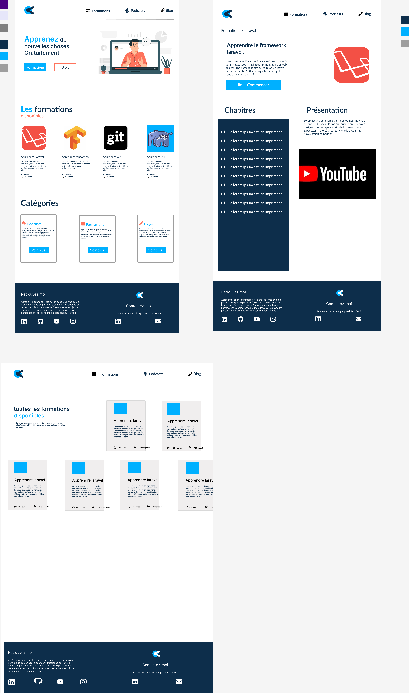

# Tout ce qu'il faut savoir sur le projet KelyKart.

## **Introductoin**

Quand on appris à programmer dans les livres et aussi via des tutoriels en ligne, quoi de plus logique que de vouloir restituer ces connaissances aux débutants et aux experts via le meme canal?

KELYKART est alors un site web sur lequel je poste des formations complètes sur des technologies du web et aussi en machine learning. 

# Les différentes 

-   Réalisation de la maquette de KELYKART: [Maquette de KelyKart](https://www.figma.com/file/G7RvPVCARjMECtCAYsLlMT/Qk-v2?node-id=0%3A1&t=wuM0OUTbxv60Jyfw-1)

-    Développement des différentes vues du site Frontend avec HTML, CSS, Js, Sass :
>   -    vue Index, 
>   - une vue pour afficher toutes les formations
> - Une vue pour afficher les details de la formation choisie
> - une vue pour afficher toutes les tutoriels
>  - Une vue pour afficher la formation choisie
>   - Une vue afficher le contenu d'un tutoriel en vidéo et en format texte.
>   - une vue pour afficher toutes les podcasts
>   - une vue pour afficher les informations sur le podcasts choisie
>   - Une vue pour afficher le contenu d'une d'un podcast.
>  

-   Développer les fonctionalités CRUD pour le modèle Formation

# **La maquette de KelyKart**

Je réalise cette maquette avec Figma: [Maquette de KelyKart](https://www.figma.com/file/G7RvPVCARjMECtCAYsLlMT/Qk-v2?node-id=0%3A1&t=wuM0OUTbxv60Jyfw-1)

Page d'accueil:

